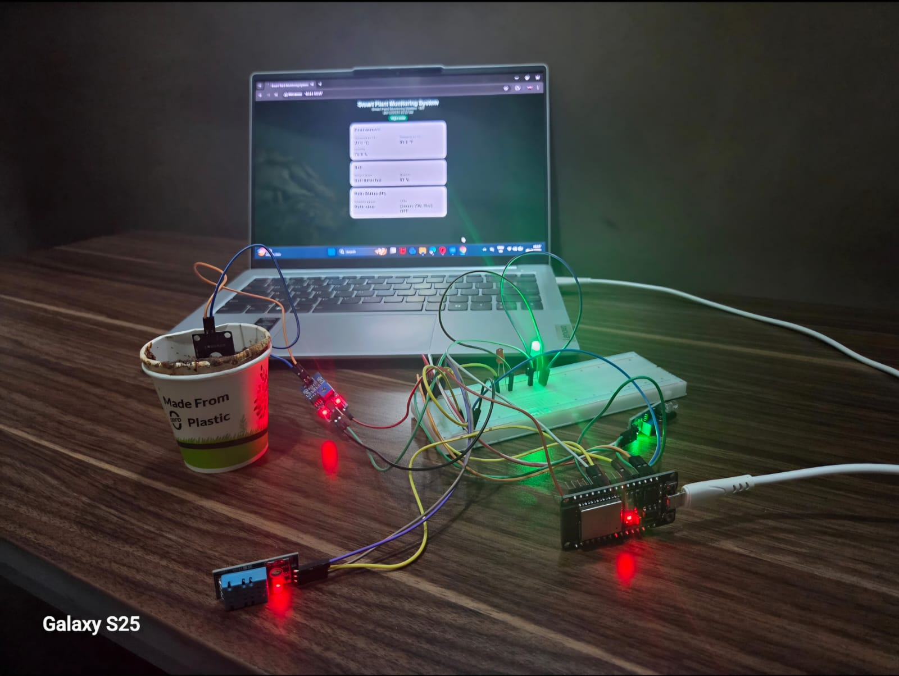
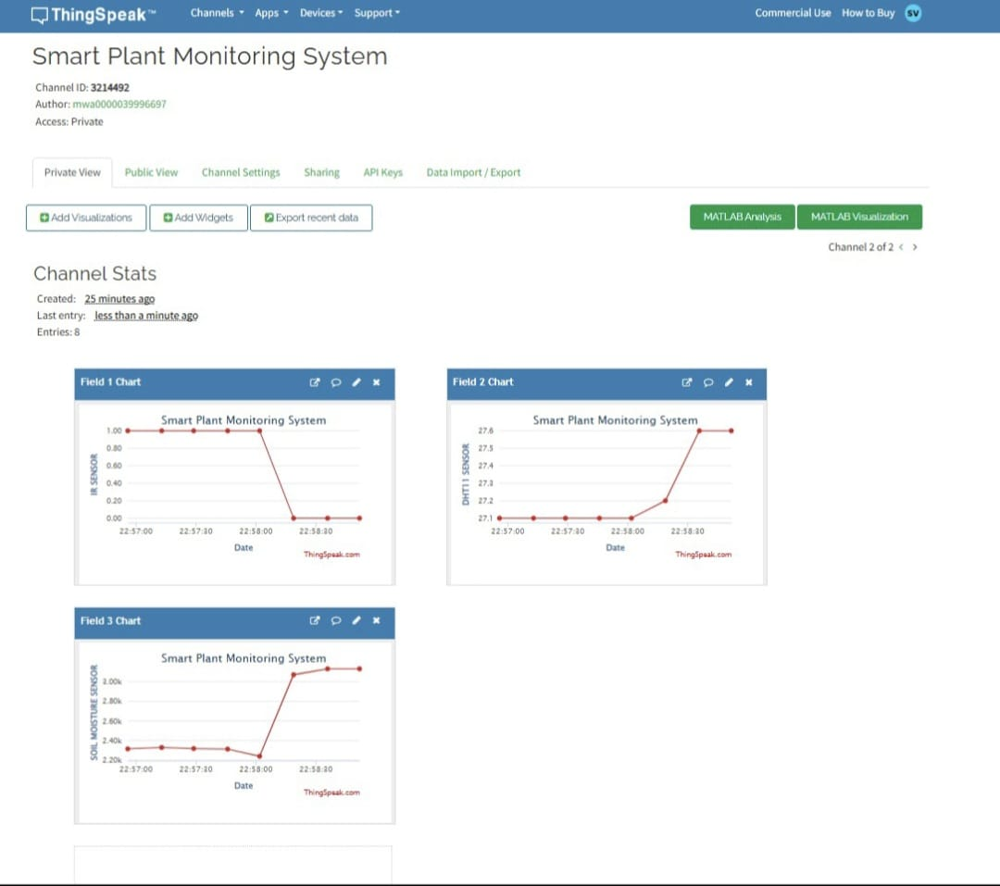
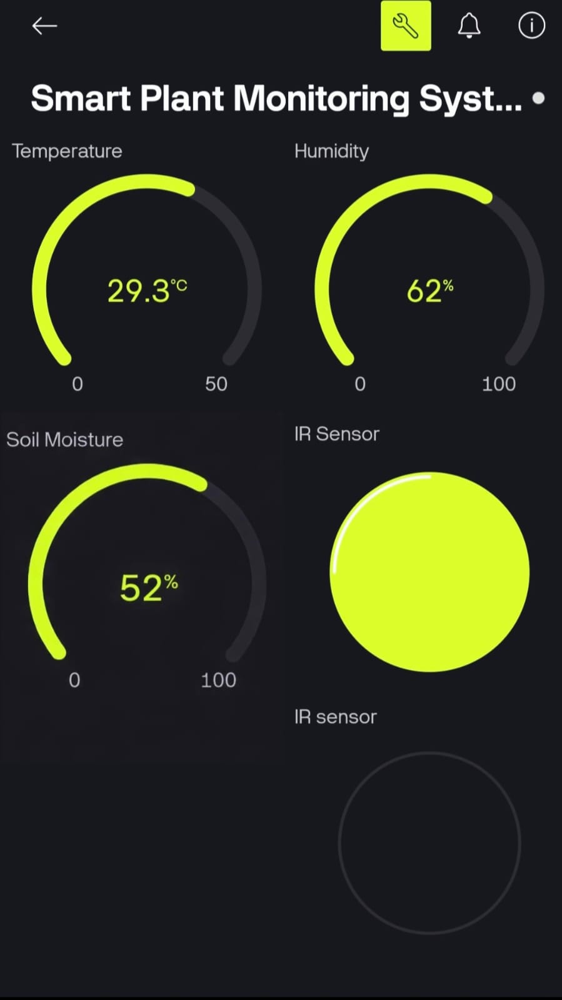
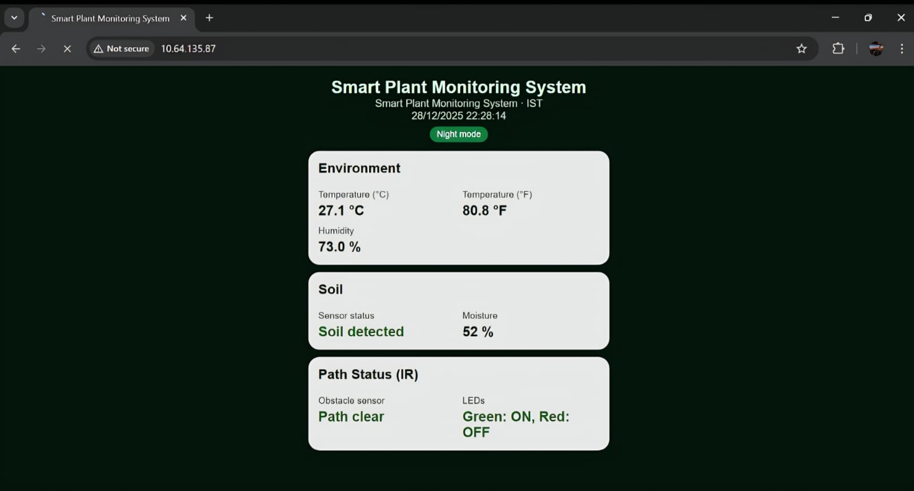

# Smart Plant Monitoring System using ESP32

## Overview
This project is an IoT-based Smart Plant Monitoring System designed to monitor soil and environmental conditions in real time. It uses an ESP32 microcontroller along with multiple sensors to collect data and display it on cloud platforms and web interfaces.

The system measures soil moisture, temperature, and humidity, and allows remote monitoring through ThingSpeak, Blynk, and a local web server.

## Features
- Real-time soil moisture monitoring
- Temperature and humidity sensing
- Obstacle detection using IR sensor
- IoT integration with ThingSpeak
- Mobile monitoring using Blynk app
- Live data display via ESP32 web server
- LED indication for system status

## Components Used
- ESP32 Development Board (ESP32-WROOM-32)
- Soil Moisture Sensor (Analog)
- DHT11 Temperature & Humidity Sensor
- IR Obstacle Sensor Module
- Breadboard
- Jumper Wires
- Green LED
- Red LED
- USB Type-B Cable
- 5V Power Supply

## Working Principle
The ESP32 acts as the main controller and reads data from:
- Soil moisture sensor (soil water level)
- DHT11 sensor (temperature and humidity)
- IR sensor (obstacle detection)

The collected data is processed and:
- Sent to ThingSpeak for cloud visualization
- Displayed on Blynk app for mobile monitoring
- Hosted on a local webpage using ESP32

LED indicators:
- Green LED → Normal condition
- Red LED → Obstacle detected

## IoT Platforms Used
- ThingSpeak (data visualization)
- Blynk (mobile dashboard)
- ESP32 Web Server (local monitoring)

## Applications
- Smart agriculture
- Home gardening
- Environmental monitoring
- Automated irrigation systems (extendable)

## Advantages
- Low cost
- Real-time monitoring
- Wireless connectivity
- Easy to expand
- User-friendly

## Project Images

### Hardware Setup

### ThingSpeak Output

### Blynk App

### Web Dashboard

## Future Improvements
- Automatic watering system
- Mobile notifications
- AI-based monitoring
- Solar-powered system

## How to Use
1. Connect all components to ESP32
2. Upload code using Arduino IDE
3. Connect ESP32 to Wi-Fi
4. Open ThingSpeak or Blynk app
5. Monitor real-time data

## Author
Sreevarshini S  
B.Tech Electronics and Communication Engineering
